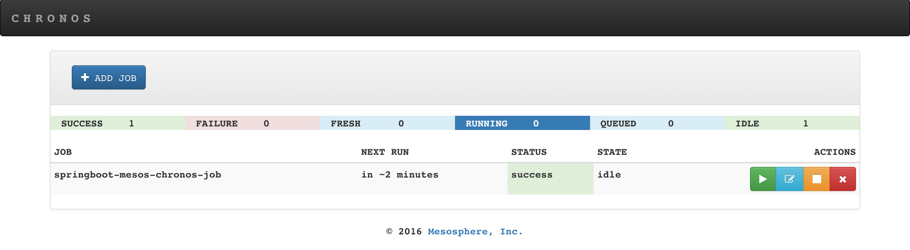
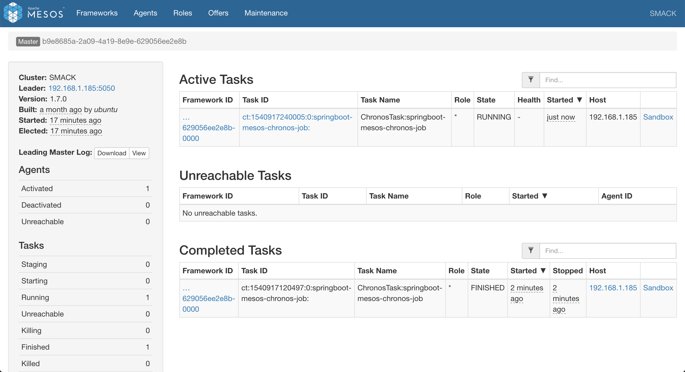

# `springboot-mesos-chronos`

The goal of this project is to create a simple [`Spring Boot`](https://docs.spring.io/spring-boot/docs/current/reference/htmlsingle/)
Java application called `simple-service` and use [`Mesos`](http://mesos.apache.org) / [`Chronos`](https://mesos.github.io/chronos)
to run it in specific intervals.

## Application

### simple-service

It is a dummy and simple `Spring Boot` Java application. In order to simulate the finishing status of the application
successfully or with an error, there is an environment variable `EXIT_CODE`. Besides, there is another environment
variable called `SLEEP`. It can be used to change the amount of time the thread sleeps (in milliseconds). The idea of
the `SLEEP` is to simulate the application processing time.

The table below summarizes the environment variables.

| Env. variable | Values                    | Default | Description                                                            |
| ------------- | ------------------------- | ------- | ---------------------------------------------------------------------- |
| `EXIT_CODE`   | 0 = success; !0 = failure | 0       | For simulating the finishing status of the application                 |
| `SLEEP`       | integer > 0               | 5000    | For simulating the application processing time (value in milliseconds) |

## Start Environment

Open one terminal and export the machine ip address to `HOST_IP_ADDR` environment variable. It can be obtained by
executing `ifconfig` command on Mac/Linux terminal or `ipconfig` on Windows
```
export HOST_IP_ADDR=...
```

Inside `springboot-mesos-chronos` root folder and run
```
docker-compose up -d
```

In order to check if all services are up and running type
```
docker-compose ps
```

Wait a little bit until `chronos`, `mesos-master` and `zookeeper` are Up (healthy). You should see something like
```
Name           Command                          State          Ports
--------------------------------------------------------------------------
chronos        /chronos/bin/start.sh --zk ...   Up (healthy)   0.0.0.0:4400->4400/tcp
mesos-master   mesos-master --registry=in ...   Up (healthy)   0.0.0.0:5050->5050/tcp
mesos-slave    mesos-slave                      Up             0.0.0.0:5151->5151/tcp
zookeeper      /docker-entrypoint.sh zkSe ...   Up (healthy)   0.0.0.0:2181->2181/tcp...
```

### Services URLs

| Service | URL                   |
| ------- | --------------------- |
| Mesos   | http://localhost:5050 |
| Chronos | http://localhost:4400 |

## Build Docker Image

In a terminal and inside `springboot-mesos-chronos` root folder, run the following command
```
./mvnw clean package dockerfile:build -DskipTests --projects simple-service
```

## Run Docker Container

In order to check whether the image was built correctly, run the container
```
docker run --rm \
  --name simple-service \
  -e EXIT_CODE=0 \
  -e SLEEP=1000 \
  docker.mycompany.com/simple-service:1.0.0; echo $?
```

## Running as a Chronos Job

Before adding the job to `Chronos`, edit some properties present in `springboot-mesos-chronos/chronos/simple-service.json`.
For example, change the `schedule` to a specific date/time (UTC) in the future.

Then, in a terminal and inside `springboot-mesos-chronos` root folder, run the `curl` command below to add jobs to
`Chronos`. For more `Chronos` endpoints visit https://mesos.github.io/chronos/docs/api.html.
```
curl -i -X POST \
  -H "Content-Type: application/json" \
  -d@./chronos/simple-service.json \
  http://localhost:4400/v1/scheduler/iso8601
```

In order to check and edit the schedule of the jobs in [`Chronos`](http://localhost:4400) website running locally.



To check the history of complete tasks, stderr and stdout of those tasks, etc, go to [`Mesos`](http://localhost:5050)
website running locally.



## Shutdown

To stop and remove containers, networks and volumes, run
```
docker-compose down -v
docker rm -v $(docker ps -a -f status=exited -f status=created -q)
```